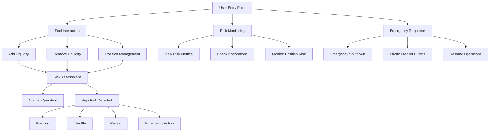

# Risk Analyzer Protocol - Detailed Path Breakdown

## 1. Standard Pool Interaction Path

```mermaid
sequenceDiagram
    participant U as User
    participant H as RiskAnalyzerHook
    participant R as RiskRegistry
    participant P as PositionManager
    participant L as LiquidityScoring
    participant V as VolatilityOracle
    participant N as RiskNotifier

    %% Add Liquidity Flow
    rect rgb(6,6,51)
        Note over U,N: Add Liquidity Flow
        U->>H: Request Add Liquidity
        activate H
        H->>R: Check Pool Parameters
        R-->>H: Pool Risk Parameters
        H->>V: Check Current Volatility
        V-->>H: Volatility Score
        H->>L: Assess Liquidity Impact
        L-->>H: Liquidity Score
        
        alt Risk Checks Pass
            H->>P: Update Position Data
            P-->>H: Position Updated
            H-->>U: Liquidity Addition Approved
            U->>H: Execute Addition
            H->>P: Record New Position
            H->>N: Generate Success Notification
        else Risk Checks Fail
            H-->>U: Addition Rejected
            H->>N: Generate Risk Alert
        end
        deactivate H
    end

    %% Remove Liquidity Flow
    rect rgb(51,6,6)
        Note over U,N: Remove Liquidity Flow
        U->>H: Request Remove Liquidity
        activate H
        H->>P: Get Position Data
        P-->>H: Current Position
        H->>L: Calculate Impact
        L-->>H: Impact Assessment
        
        alt Safe Removal
            H-->>U: Removal Approved
            U->>H: Execute Removal
            H->>P: Update Position
            H->>N: Confirm Removal
        else Unsafe Removal
            H-->>U: Removal Restricted
            H->>N: Send Risk Warning
        end
        deactivate H
    end

    %% Position Management Flow
    rect rgb(6,51,6)
        Note over U,N: Position Management Flow
        U->>P: Request Position Data
        P-->>U: Position Details
        U->>H: Monitor Risk Score
        activate H
        H->>V: Get Latest Volatility
        V-->>H: Volatility Data
        H->>L: Get Liquidity Metrics
        L-->>H: Liquidity Data
        H->>P: Calculate Position Risk
        P-->>H: Risk Score
        H-->>U: Current Risk Assessment
        
        alt High Risk Detected
            H->>N: Issue Risk Alert
            N-->>U: Risk Notification
        end
        deactivate H
    end
```


### A. Pool Liquidity Addition
1. User initiates liquidity addition
2. System triggers `beforeAddLiquidity` hook
3. Risk analyzer performs pre-checks:
   - Volatility assessment
   - Current liquidity depth analysis
   - Concentration risk evaluation
4. If checks pass:
   - Liquidity addition proceeds
   - Position risk data is updated
   - New risk metrics are calculated
5. System triggers `afterAddLiquidity` hook
6. Risk notifications are generated if needed

### B. Pool Liquidity Removal
1. User initiates liquidity removal
2. System triggers `beforeRemoveLiquidity` hook
3. Risk analyzer checks:
   - Impact on pool liquidity
   - Position concentration effects
   - Overall pool stability
4. If checks pass:
   - Liquidity removal proceeds
   - Risk metrics are updated
   - System stability is reassessed
5. System triggers `afterRemoveLiquidity` hook

### C. Position Management
1. User accesses position data via `getPositionData`
2. System provides:
   - Current position size
   - Tick range
   - Risk score
   - Last update timestamp
3. User can monitor position risk via `getPositionRiskScore`
4. System updates position risk regularly

## 2. Risk Monitoring Path

### A. Pool Risk Assessment
1. System continuously monitors:
   - Volatility via `IVolatilityOracle`
   - Liquidity depth via `ILiquidityScoring`
   - Concentration risk
2. Risk metrics are updated every block:
   ```solidity
   struct RiskMetrics {
       uint256 volatility;
       uint256 liquidityDepth;
       uint256 concentrationRisk;
       uint256 lastUpdateBlock;
       int256 lastPrice;
       uint256 updateCounter;
   }
   ```
3. Risk scores are aggregated via `IRiskAggregator`

### B. Notification System
1. System monitors thresholds
2. When risks are detected:
   - `IRiskNotifier` generates alerts
   - Users receive notifications via `notifyUser`
   - Risk levels and messages are stored
3. Users can access notifications via `getUserNotifications`

## 3. Emergency Response Path

### A. Circuit Breaker Activation
1. System detects high-risk conditions:
   ```solidity
   struct CircuitBreaker {
       uint256 threshold;
       uint256 cooldownPeriod;
       uint256 lastTriggered;
       bool isActive;
   }
   ```
2. Circuit breaker triggers if thresholds exceeded
3. Operations are automatically paused
4. Notifications sent to all affected users

### B. Emergency Shutdown
1. High risk detected via continuous monitoring
2. `emergencyShutdown` function triggered
3. All pool operations suspended
4. Risk control actions implemented:
   ```solidity
   enum ActionType {
       WARNING,
       THROTTLE,
       PAUSE,
       EMERGENCY
   }
   ```
5. System enters cool-down period

### C. Operations Resume
1. Risk levels return to acceptable range
2. Cool-down period expires
3. `resumeOperations` function called
4. System gradually restores normal operations
5. Enhanced monitoring period begins

## 4. Administrative Path

### A. Risk Parameter Management
1. Admins configure risk parameters:
   ```solidity
   struct RiskParameters {
       uint256 volatilityThreshold;
       uint256 liquidityThreshold;
       uint256 concentrationThreshold;
       bool isActive;
   }
   ```
2. Parameters are updated via `updateRiskParameters`
3. New configurations are validated
4. Changes are logged and monitored

### B. Pool Registration
1. New pool registration via `registerPool`
2. Initial risk parameters set
3. Monitoring systems activated
4. Pool added to registry
5. Initial risk assessment performed

## 5. Position Risk Management Path

### A. Risk Assessment
1. System calculates position-specific risks:
   ```solidity
   struct PositionRisk {
       uint256 size;
       int24 tickLower;
       int24 tickUpper;
       uint256 riskScore;
       uint256 lastAssessment;
   }
   ```
2. Risk scores updated regularly
3. Position health monitored continuously

### B. High-Risk Position Handling
1. System identifies high-risk positions
2. Warning notifications sent to users
3. Automatic risk mitigation options presented
4. Position closure available via `closeRiskyPosition`
5. Risk registry updated

## 6. Aggregated Risk Analysis Path

### A. System-Wide Risk Assessment
1. `IRiskAggregator` combines metrics:
   - Pool-specific risks
   - User position risks
   - Market conditions
2. System calculates:
   - Total risk score
   - Average risk levels
   - High-risk pool count
3. Results accessible via `getSystemRisk`

### B. Risk Distribution Analysis
1. System analyzes:
   - Risk concentration patterns
   - User exposure distribution
   - Pool risk correlations
2. Results feed into risk parameters
3. System adjusts thresholds automatically
